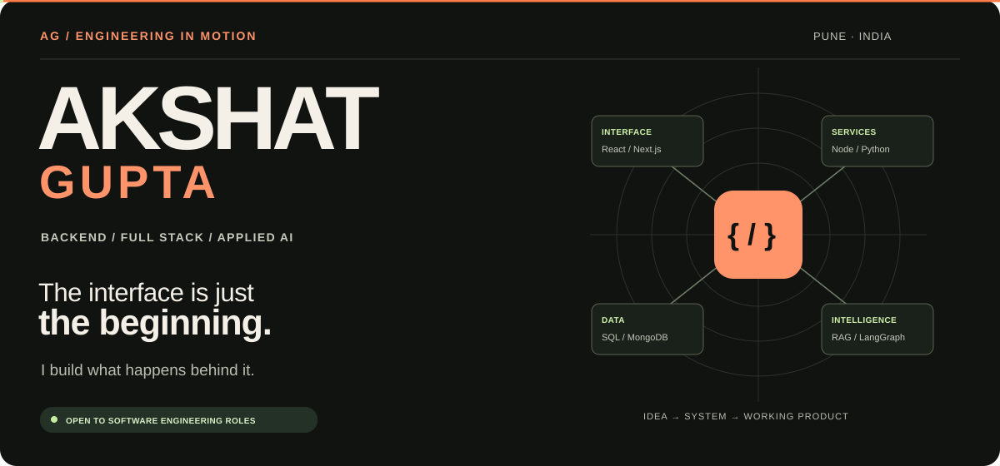

### Backend depth. Full stack delivery. Practical AI.

I build web applications, backend services, and practical AI workflows. 
My work spans payment flows, database optimization, and document intelligence.

  
  
  

**Pune, India · Computer Engineering @ SPPU · Graduating 2027**

Open to **SDE internships** and **full-time backend / full stack opportunities**.

[Projects](#selected-projects) &nbsp; / &nbsp; [Experience](#experience) &nbsp; / &nbsp; [Skills](#technical-skills) &nbsp; / &nbsp; [Credentials](#learning--participation) &nbsp; / &nbsp; [Contact](#lets-connect)

---

<table>
  <tr>
    <td width="33%" align="center"><h3>30% lower latency</h3>
MongoDB schema and indexing improvements at Uptoskill
</td>
    <td width="33%" align="center"><h3>Payment flow shipped</h3>
React interfaces, backend APIs, testing, and deployment at Indux
</td>
    <td width="33%" align="center"><h3>20+ LMS APIs</h3>
Authentication, quizzes, grading, and student analytics
</td>
  </tr>
</table>

## What I build

I'm a Computer Engineering student who enjoys taking features from requirements through implementation, testing, and deployment. Across internships and personal projects, I've worked on:

- **Backend services** — REST APIs, authentication, payment workflows, and database performance.
- **Applied AI** — document retrieval, conversational integrations, and multi-step automation.
- **Full stack products** — React and Next.js interfaces connected to Node.js and Python services.

  
  
  
  
  
  
  

## Selected projects

Four applications. Four different engineering problems.

<table>
<tr>
<td width="50%" valign="top">
<h3>01 / DocBrain AI</h3>

<b>Turn documents into searchable knowledge.</b>

Document question answering with vector and keyword retrieval, rank fusion, and separate application and AI services.

<b>Inside:</b> ChromaDB + BM25 + LangGraph; Node.js / FastAPI communication through Redis Pub/Sub.

<code>Next.js</code> <code>FastAPI</code> <code>RAG</code> <code>Docker</code>

<a href="https://github.com/lxakshaseth/docbrain-ai"><b>Explore the code →</b></a>
</td>
<td width="50%" valign="top">
<h3>02 / SyncLeads-360</h3>

<b>Connect lead data to actionable workflows.</b>

Multi-step AI automation for lead enrichment, scoring, and intent classification.

<b>Inside:</b> LangGraph workflows, Redis caching, PostgreSQL relational data, and MongoDB interaction logs.

<code>Next.js</code> <code>LangGraph</code> <code>PostgreSQL</code>

<a href="https://github.com/lxakshaseth/SyncLeads-360"><b>Explore the code →</b></a>
</td>
</tr>
<tr>
<td width="50%" valign="top">
<h3>03 / Smart AI LMS</h3>

<b>Bring learning, feedback, and collaboration together.</b>

An LMS with quizzes, student analytics, OCR-assisted answer evaluation, and live communication.

<b>Inside:</b> 20+ REST APIs, WebRTC audio/video, Socket.IO chat, and role-based access control.

<code>React</code> <code>Node.js</code> <code>MongoDB</code> <code>WebRTC</code>

<a href="https://github.com/lxakshaseth/Smart-LMS"><b>Explore the code →</b></a>
</td>
<td width="50%" valign="top">
<h3>04 / Civic AI Platform</h3>

<b>Give citizen complaints a structured path.</b>

A civic application for complaint logging, AI-assisted classification, and resolution routing.

<b>Inside:</b> Normalized PostgreSQL schemas, tuned joins and indexes, and separate business and persistence layers.

<code>Next.js</code> <code>Express</code> <code>PostgreSQL</code>

<a href="https://github.com/lxakshaseth/civic-ai-platform"><b>Explore the code →</b></a>
</td>
</tr>
</table>

<b>Explore the implementation details</b>

### [DocBrain AI](https://github.com/lxakshaseth/docbrain-ai)
**Document retrieval and conversational AI**

Built a document question-answering system with hybrid retrieval and separate application and AI services.

- Combined ChromaDB vector search and BM25 keyword search using Reciprocal Rank Fusion to retrieve context for generated answers.
- Orchestrated retrieval workflows with LangGraph and used Redis Pub/Sub for communication between Node.js and FastAPI services.
- Implemented JWT authentication, Zod validation, and a repository layer; containerized services with Docker Compose.

`Next.js` `Node.js` `FastAPI` `LangGraph` `ChromaDB` `Redis` `Docker`

### [SyncLeads-360](https://github.com/lxakshaseth/SyncLeads-360)
**Lead enrichment and sales automation**

Built multi-step AI workflows for lead enrichment, scoring, and intent classification.

- Used LangGraph and LangChain to coordinate workflow steps, with hybrid retrieval and Redis caching.
- Used PostgreSQL for relational data and MongoDB for flexible interaction logs.
- Added JWT authentication, role-based access control, containerized services, and deployment automation.

`Next.js` `FastAPI` `LangGraph` `PostgreSQL` `MongoDB` `Redis`

### [Smart AI LMS](https://github.com/lxakshaseth/Smart-LMS)
**Learning management, answer evaluation, and live collaboration**

Built an LMS combining student workflows, AI-assisted evaluation, and real-time communication.

- Implemented **20+ REST APIs** for authentication, quizzes, grading, and student performance tracking.
- Combined OCR with Groq and OpenAI APIs to process handwritten or printed answers and generate structured feedback.
- Integrated WebRTC audio/video calls and Socket.IO chat, with role-based access control.

`React` `Node.js` `MongoDB` `WebRTC` `Socket.IO` `OpenAI API`

### [Civic AI Platform](https://github.com/lxakshaseth/civic-ai-platform)
**Citizen grievance classification and routing**

Built a civic engagement application for logging, classifying, and routing citizen complaints.

- Integrated LLM APIs for conversational complaint classification.
- Designed normalized PostgreSQL schemas and tuned SQL joins and multi-column indexes.
- Separated routes, business logic, and persistence using MVC architecture.

`Next.js` `Express` `PostgreSQL` `Groq API` `OpenAI API`

## Experience

### Indux Technology · Full Stack Developer Intern
**February–August 2026 · Remote**

**Print Pro — payment module**

- Built the payment module from requirements through release, connecting React payment interfaces to Node.js/Express REST APIs.
- Wrote automated tests for transaction states and failure scenarios before rollout.
- Deployed and supported the payment flow on [avcc.cloud](https://avcc.cloud).

**Sales & automation platform**

- Integrated a retrieval-augmented generation (RAG) pipeline into conversational sales workflows.
- Implemented per-user session isolation for the WhatsApp Business API integration to keep conversation context separate across concurrent users.

### Uptoskill · Full Stack Web Development Intern
**October 2025–April 2026 · Remote**

- Built web platform features across the UI, REST APIs, and database, from requirements through deployment.
- **Reduced API latency by 30%** by identifying query bottlenecks, revising MongoDB schemas, and adding compound indexes.
- Debugged issues across the application stack, added automated validation, and provided post-deployment support.

## Technical skills

| Area | Technologies & practices |
| :--- | :--- |
| **Languages** | JavaScript, TypeScript, Python, SQL |
| **Backend** | Node.js, Express, FastAPI, REST APIs, JWT, RBAC, Zod |
| **Frontend** | React, Next.js, Tailwind CSS, Redux, Zustand, React Query |
| **Data** | MongoDB, PostgreSQL, MySQL, Redis, schema design, query optimization |
| **Applied AI** | LangGraph, LangChain, RAG, ChromaDB, BM25, OpenAI API, Groq API, OCR |
| **Cloud & delivery** | Docker, Docker Compose, AWS S3 / Lambda / API Gateway, Vercel, Render, CI/CD |
| **Real-time & tools** | WebRTC, Socket.IO, Git, GitHub, Postman |

## Education & credentials

**B.E. in Computer Engineering · Savitribai Phule Pune University (SPPU)**  
Expected graduation: **2027** · CGPA: **8.25 / 10**

- **Microsoft Certified: Azure Fundamentals** — September 2026
- **Oracle Agentic AI Certified Foundations Associate** — July 2026
- **Oracle Cloud Infrastructure 2025 AI Foundations Associate** — July 2025
- **AWS training:** Cloud Practitioner Essentials, Technical Essentials, Security Fundamentals, DevOps, and Generative AI.

## Learning & participation

| Program / event | Recognition | Date | Supporting document |
| :--- | :--- | :--- | :--- |
| **Podar Startupthon 2K26** | Participation · Grand Finale, Nawalgarh, Rajasthan | 2 Oct 2026 | [Certificate](assets/certificates/podar-startupthon-2026.pdf) |
| **Podar Hackfest** | Participation · certificate issued by UptoSkills / Podar | Issued 7 May 2026 | [Certificate](assets/certificates/podar-hackfest-2026.pdf) |
| **Skills4Future** · Edunet Foundation, AICTE & Shell | Completed advanced course in Green Skills and Artificial Intelligence | Jan–Feb 2026 | [Certificate](assets/certificates/skills4future-ai.png) |
| **Barclays Life Skills Training** · GTT Foundation | Completed life skills training program supported by Barclays | 9 Mar 2026 | [Certificate](assets/certificates/barclays-life-skills.png) |

<b>Additional internship offers</b>

The following documents record internship offers and their scheduled dates.

| Organization | Offered role | Scheduled period | Document |
| :--- | :--- | :--- | :--- |
| ApexPlanet Software Pvt Ltd | Data Analytics Intern | 21 Jan–21 Mar 2026 | [Offer letter](assets/certificates/apexplanet-data-analytics-offer.png) |
| ApexPlanet Software Pvt Ltd | Web Development Intern · HTML, CSS & JavaScript | 11 Oct–24 Nov 2025 | [Offer letter](assets/certificates/apexplanet-web-development-offer.png) |
| Axuore Technologies | Frontend Development Intern · online | Starting 20 Jan 2025 · one month | [Offer letter](assets/certificates/axuore-frontend-offer.png) |

## Let's connect

I'm interested in teams where I can contribute to backend services, full stack products, and practical AI features. Happy to discuss my implementation choices, project architecture, and internship work.

**[Email me](mailto:aakshatt09@gmail.com)** · **[Connect on LinkedIn](https://linkedin.com/in/akshat0906)** · **[Explore my repositories](https://github.com/lxakshaseth?tab=repositories)**

   
  <b>Let's build something useful.</b>
    

